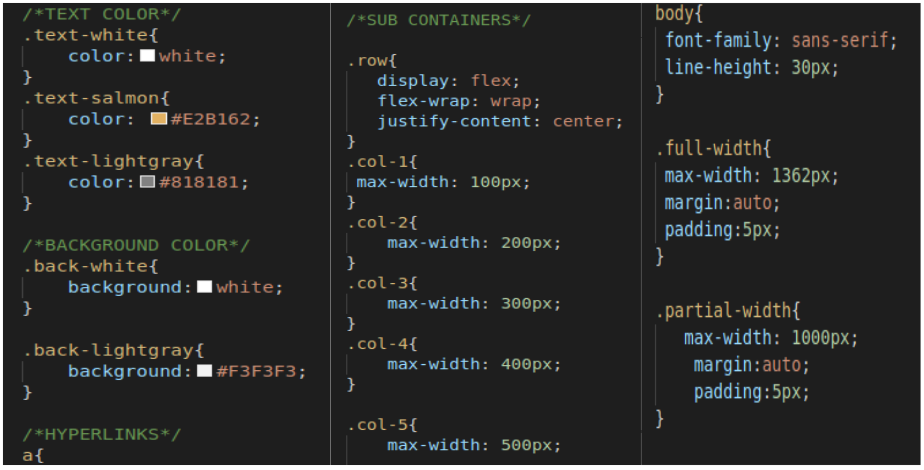

# css-grid-framework

> The css grid framework project consists of a custom css layout framework, which is part the microverse training program. The framework is then used the Odin webpage clone which is available here: https://www.theodinproject.com/.

## Built With

- HTML
- CSS

## Live Demo

[Live Demo Link of sample usage](https://raw.githack.com/ngodi/css-grid-framework/development/index.html)

## Getting Started

To get a local copy up and running follow these simple example steps.

### Setup
clone the repository using the command: git clone git@github.com:ngodi/css-grid-framework.git
navigate to the project directory: cd css-grid-framework.
Copy the layout-framework.css to your project and include file to the head section of the html file.
### Install

### Usage
Add the desired classes to your project file to obtain the desired effect.
The classes are grouped into:
*CONTAINERS
*SUBCONTAINERS
*TEXT COLOR
*BACKGROUND COLOR
>HYPERLINKS
>BUTTONS
>ALIGNMENT
>FONT-SIZE
>FONT-WEIGHT
>MARGINS
>PADDINGS

👤 **Author**
Ngodi albert
- Github: [@ngodi](https://github.com/ngodi)
- Twitter: [@albertngodi](https://twitter.com/albertngodi)
- Linkedin: [linkedin](https://www.linkedin.com/in/albert-ngodi-b80267174/)

## 🤝 Contributing

Contributions, issues and feature requests are welcome!

Feel free to check the [issues page](issues/).

## Show your support

Give a ⭐️ if you like this project!

## Acknowledgments

- Hat tip to anyone whose code was used
- Inspiration
- etc

👤 **Author**
Ngodi albert
- Github: [@ngodi](https://github.com/ngodi)
- Twitter: [@albertngodi](https://twitter.com/albertngodi)
- Linkedin: [linkedin](https://www.linkedin.com/in/albert-ngodi-b80267174/)

## 📝 License

This project is [MIT](lic.url) licensed.
